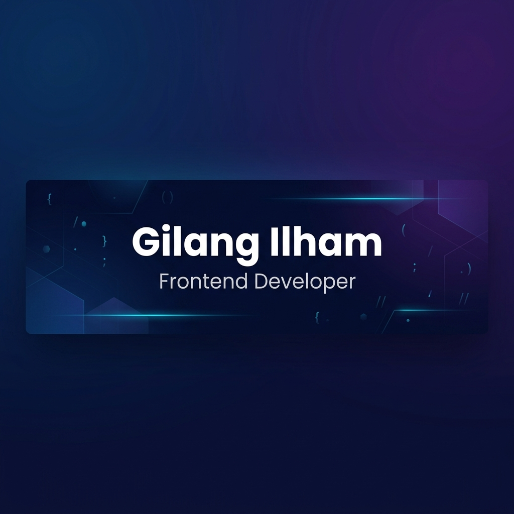

<div align="center">



[](https://git.io/typing-svg)

</div>

---

## 🧑‍💻 About Me

```javascript
const gilangIlham = {
    pronouns: "he" | "him",
    role: "Frontend Developer",
    location: "Indonesia 🇮🇩",
    currentFocus: "Building modern & responsive web applications",
    funFact: "I turn coffee into code ☕→💻"
};
```


- 🔭 Currently working on **modern web projects**
- 🌱 Exploring **Next.js, React Native & Cloud Technologies**
- 💬 Ask me about **React, Vue.js, TypeScript, Flutter**
- ⚡ Fun fact: **I debug with `console.log` and I'm not ashamed**
- 📫 Reach me at **[LinkedIn](http://www.linkedin.com/in/gilang-ilham-maulana-228341308)**

<br clear="both"/>

---

## 🛠️ Tech Stack

<div align="center">

### 🎨 Languages


### ⚛️ Frameworks & Libraries


### 🎨 UI & Styling


### 🔧 Tools & Platforms


### ☁️ Cloud & Database


### 🛠️ Design & Productivity


</div>

---

## 📊 GitHub Stats

<div align="center">


<br/>


</div>

---

## 🏆 GitHub Trophies

<div align="center">


</div>

---

## 📈 Contribution Graph

<div align="center">


</div>

---

## 🤝 Connect With Me

<div align="center">

[](https://instagram.com/glngilhm_)
[](http://www.linkedin.com/in/gilang-ilham-maulana-228341308)

</div>

---

## ✍️ Random Dev Quote

<div align="center">


</div>

---

## 🐍 Contribution Snake

<div align="center">


</div>

---

<div align="center">


</div>
