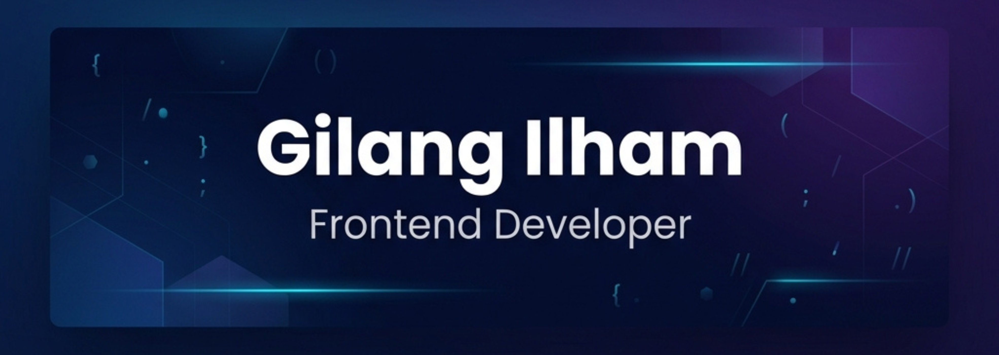

&nbsp;

&nbsp;

### About Me

I'm a Frontend Developer based in Indonesia 🇮🇩, passionate about crafting modern, responsive, and user-friendly web experiences. I enjoy turning ideas into clean, functional interfaces.

&nbsp;

### Tech Stack

**Languages** &nbsp;    

**Frontend** &nbsp;     

**Styling** &nbsp;   

**Backend & Tools** &nbsp;     

&nbsp;

### GitHub Stats

&nbsp;&nbsp;

&nbsp;

---

